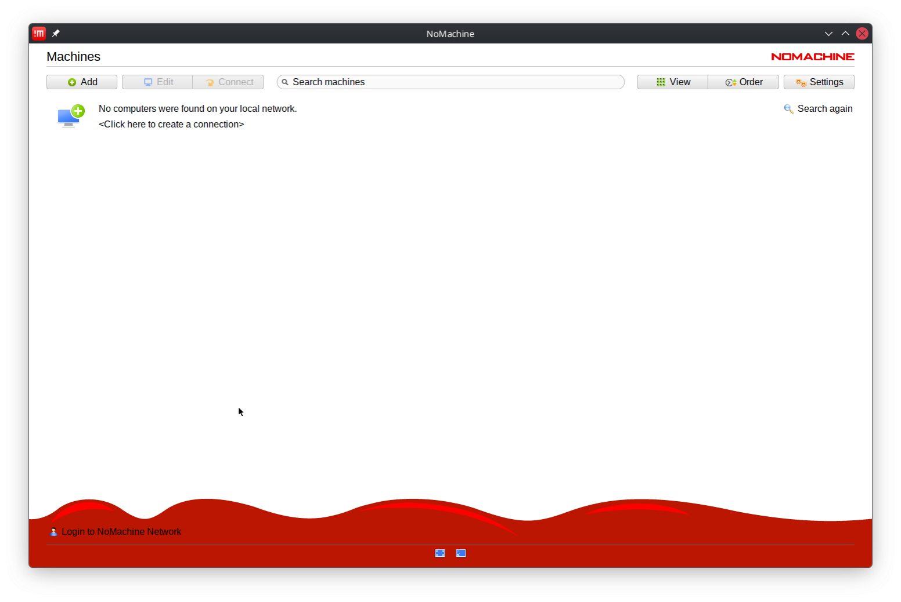
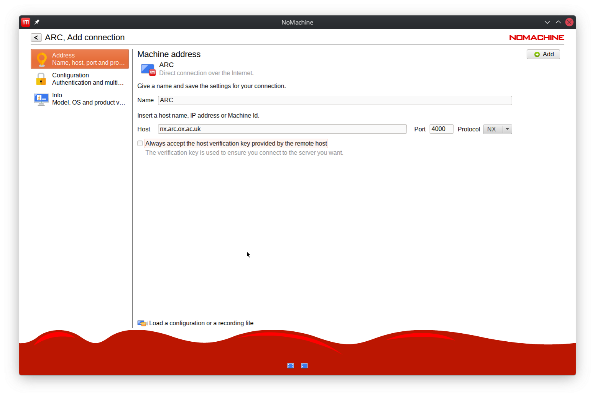
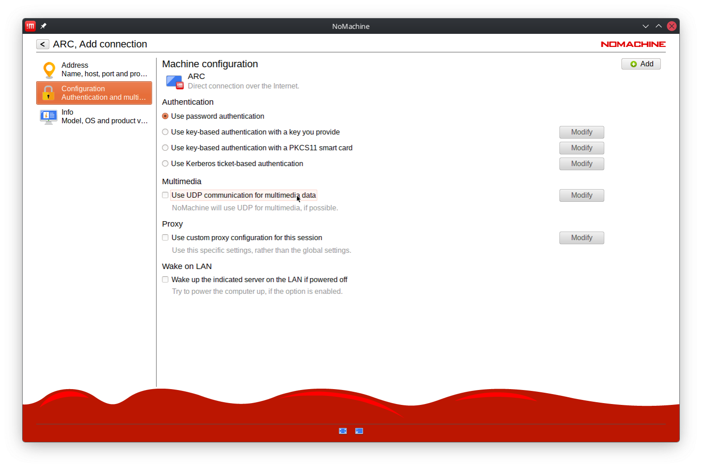
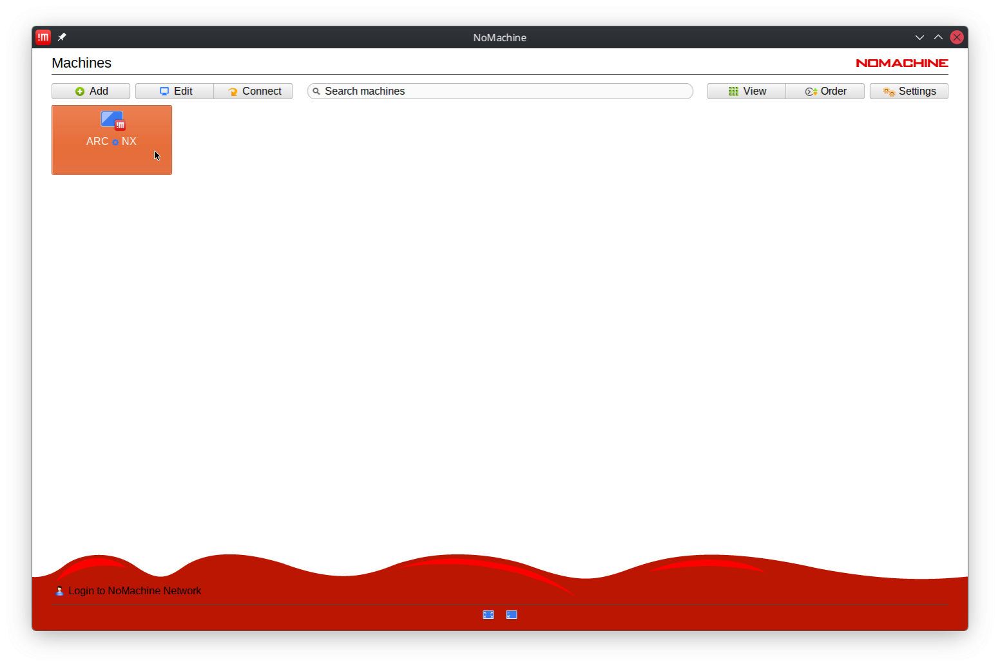
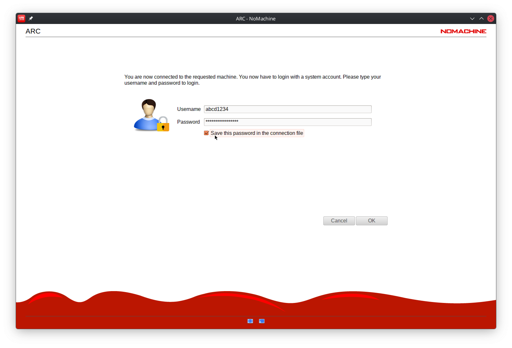
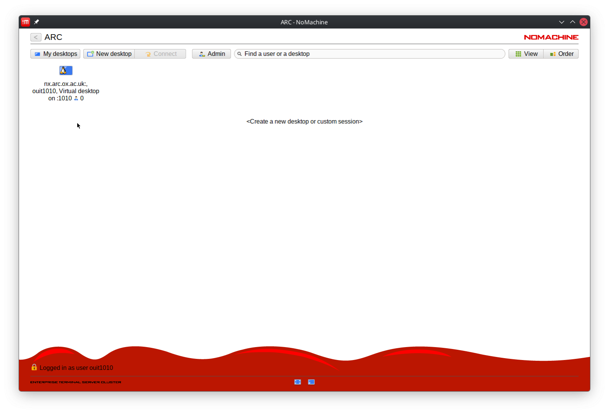
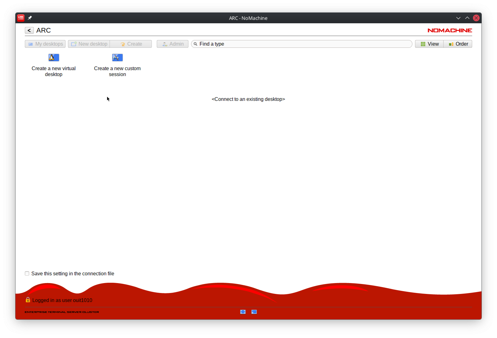
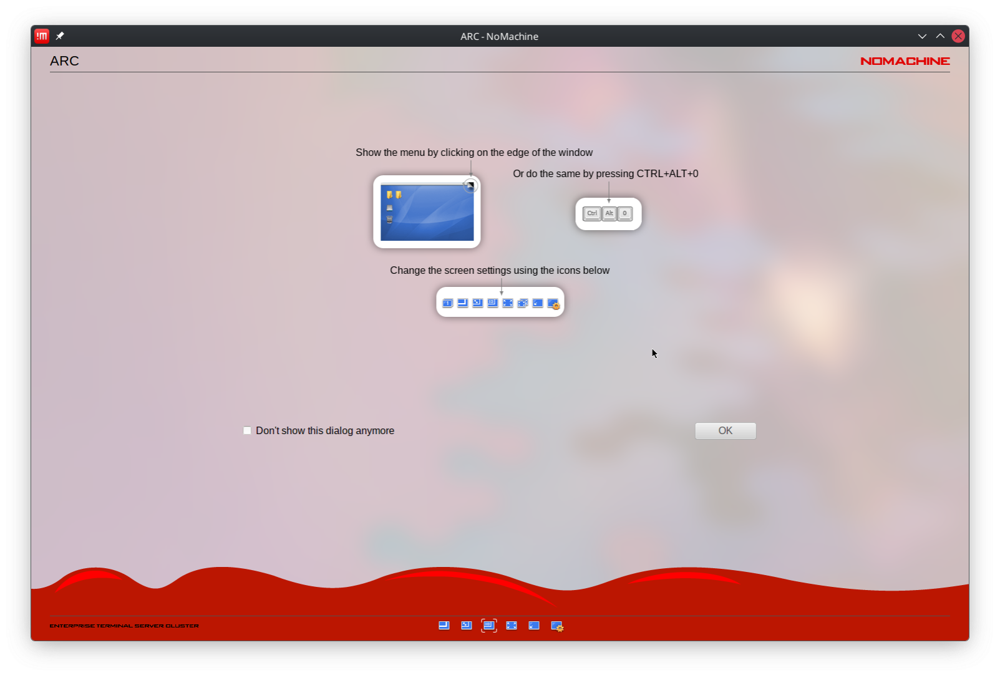
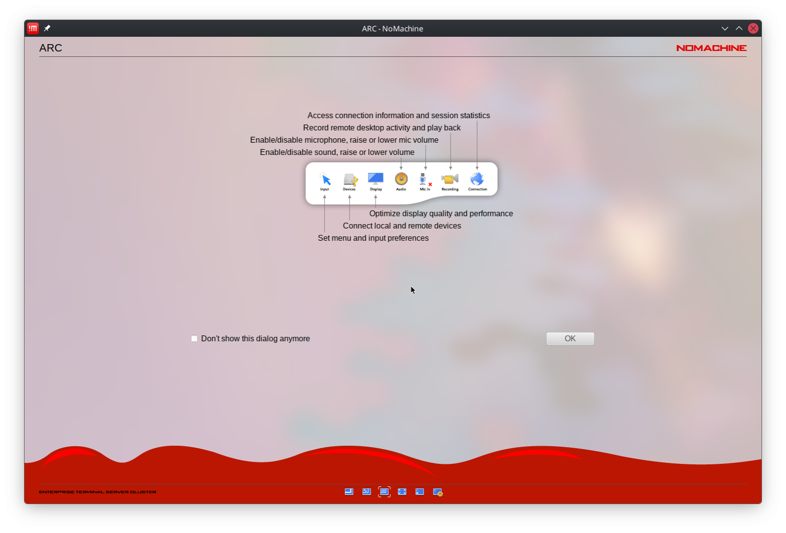
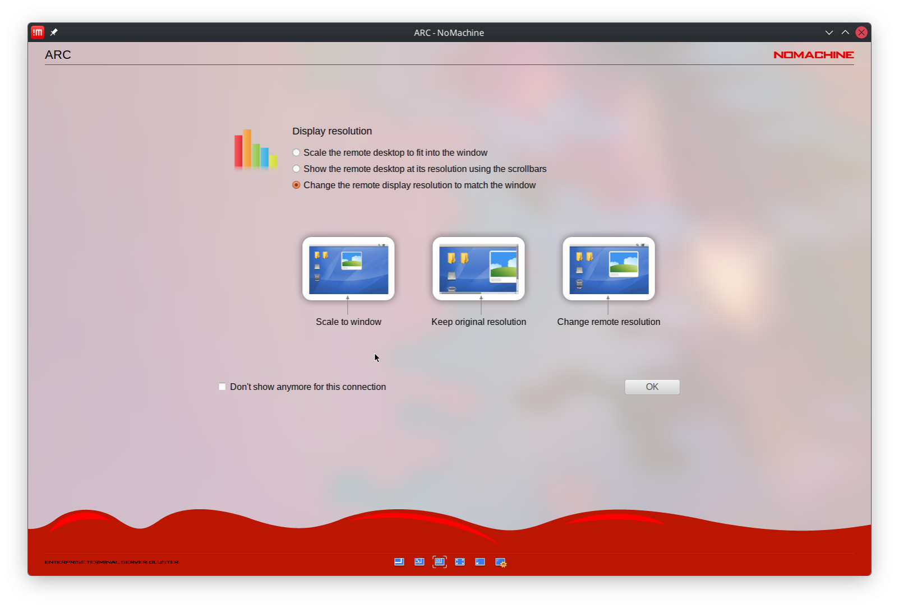

Configuring NoMachine client access
-----------------------------------

Step 1: After starting the client, click ``Add`` on the first screen to add a new connection. On the next screen give the connection a name, in the example below we have used ``ARC`` you **must** specify the host as ``nx.arc.ox.ac.uk`` and click ``Connect``

In the configuration tab, unselect the ``Use UDP communication for multimedia data``

Click "Add" in the top left to save the connection.

Step 2: Select the new connection and enter your ARC username and password:

  
Step 3: Either connect to an existing desktop session if you have one, or use the ``New Desktop`` button to create a new session...

  
then double click the ``Create new virtual desktop`` button to complete the process.
  

  
Step 4: Use the options on the following screens to configure how you would like the remote desktop session to be displayed on your local machine:

  

  

  
After clicking ``OK`` the connection will be made and you will be presented with the Linux KDE desktop in a window on your machine. The menu bar for accessing applications is at the bottom of this window.
